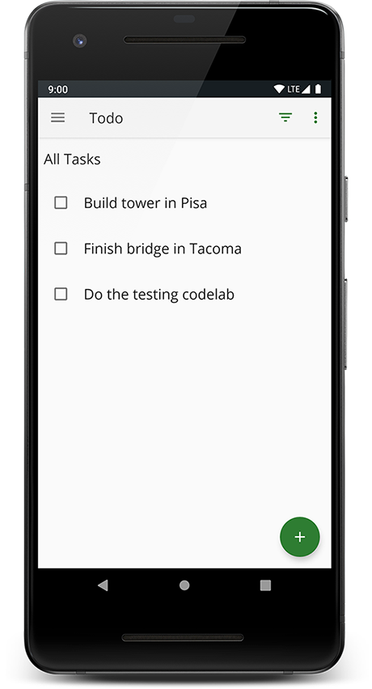

TO-DO Notes - Code for Advanced Android Kotlin Testing Codelab
============================================================================

Code for the Advanced Android Kotlin Testing Codelab 

Introduction
------------

TO-DO Notes is an app where you to write down tasks to complete. The app displays them in a list.
You can then mark them as completed or not, filter them and delete them.

Pre-requisites
--------------

You should be familiar with:

* The Kotlin programming language, including [Kotlin coroutines](https://developer.android.com/kotlin/coroutines) and their interaction with [Android Jetpack components](https://developer.android.com/topic/libraries/architecture/coroutines).
* The following core Android Jetpack libraries: [ViewModel](https://developer.android.com/topic/libraries/architecture/viewmodel),
 [LiveData](https://developer.android.com/topic/libraries/architecture/livedata),
  [Navigation Component](https://developer.android.com/guide/navigation) and 
  [Data Binding](https://developer.android.com/topic/libraries/data-binding).
* Application architecture, following the pattern from the [Guide to app architecture](https://developer.android.com/jetpack/docs/guide) and [Android Fundamentals codelabs](https://developer.android.com/courses/kotlin-android-fundamentals/toc).

